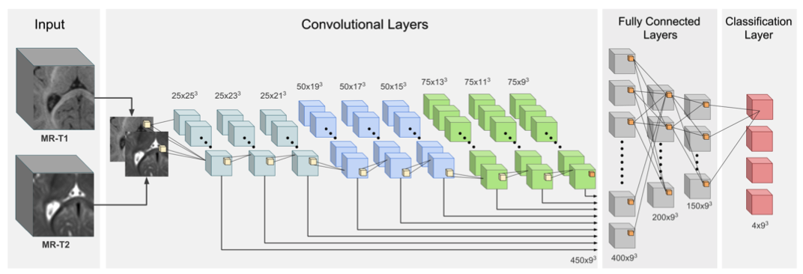

# Pytorch version of LiviaNET

This is a Pytorch implementation of LiviaNET. For the detailed architecture please refer to the original paper: [link](https://arxiv.org/pdf/1612.03925.pdf)

This is not the original implementation of the paper (Do not use it to reproduce the results). The original code is based on Theano and can be found [here](https://github.com/josedolz/LiviaNET)


### Dependencies
This code depends on the following libraries:

- Python >= 3.5
- Pytorch 0.3.1 (Testing on more recent versions)
- nibabel
- medpy


### Training

The model can be trained using below command:  
```
python mainLiviaNet.py
```

## Preparing your data
- To use your own data, you will have to specify the path to the folder containing this data (--root_dir).
- Images have to be in nifti (.nii) format
- You have to split your data into two folders: Training/Validation. Each folder will contain 2 sub-folders: 1 subfolder that will contain the image modality and GT, which contain the nifti files for the images and their corresponding ground truths. 
- In the runTraining function, you have to change the name of the subfolders to the names you have in your dataset (lines 129-130 and 143-144).

## Current version
- The current version includes LiviaNET. We are working on including some extensions we made for different challenges (e.g., semiDenseNet on iSEG and ENIGMA MICCAI Challenges (2nd place in both))
- A version of SemiDenseNet for single modality segmentation has been added. You can choose the network you want to use with the argument --network
```
--network liviaNet  o  --network SemiDenseNet
```
- Patch size, and sampling steps values are hard-coded. We will work on a generalization of this, allowing the user to decide the input patch size and the frequence to sample the patches.

If you use this code in your research, please consider citing the following paper:

- Dolz, Jose, Christian Desrosiers, and Ismail Ben Ayed. "3D fully convolutional networks for subcortical segmentation in MRI: A large-scale study." NeuroImage 170 (2018): 456-470.

If in addition you use the semiDenseNet architecture, please consider citing these two papers:

- [1] Dolz J, Desrosiers C, Wang L, Yuan J, Shen D, Ayed IB. Deep CNN ensembles and suggestive annotations for infant brain MRI segmentation. Computerized Medical Imaging and Graphics. 2019 Nov 15:101660.

- [2] Carass A, Cuzzocreo JL, Han S, Hernandez-Castillo CR, Rasser PE, Ganz M, Beliveau V, Dolz J, Ayed IB, Desrosiers C, Thyreau B. Comparing fully automated state-of-the-art cerebellum parcellation from magnetic resonance images. NeuroImage. 2018 Dec 1;183:150-72.

### Design of the semiDenseNet architecture


# LiviaNet_pytorch
